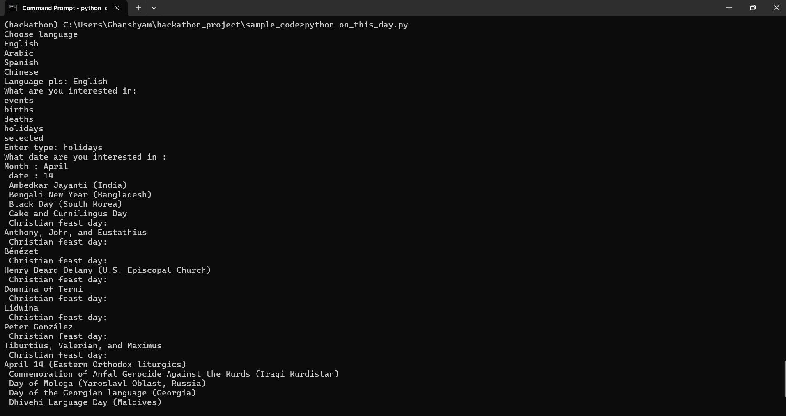
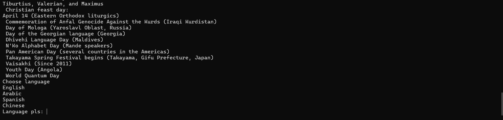
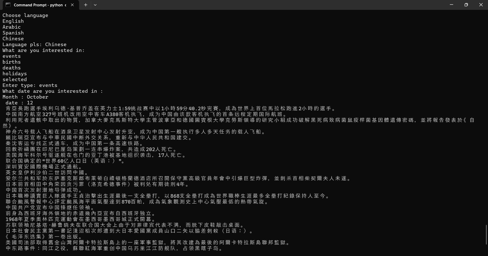
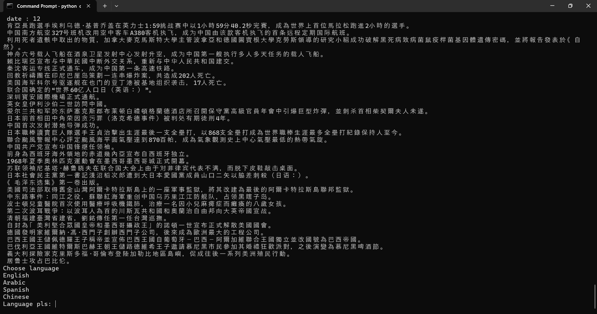

# 🕰️ Bot Idea: **Today in History**

## 🧠 Powered By: Wikimedia *On This Day* API

Explore significant historical events tied to any specific date. This bot fosters curiosity and civic awareness by delivering curated information across four categories. Responses can be customized by date and language preference.

---

## ✨ Features

- **Events** – Discover notable historical events that occurred on a specific day.  
- **Births** – Learn about influential people born on this date.  
- **Deaths** – Find out who passed away on this day in history.  
- **Holidays** – Explore global holidays and observances.

---

## 🚀 Live Demo

*(Coming Soon)*

---

## 📖 How to Use

1. **Choose your preferred language** for the response.  
2. **Select the category**: Events, Births, Deaths, or Holidays.  
3. **Pick a date** (month and day) to receive historical insights.

### Examples

---

## 🛠️ Technologies Used

- Python  
- Node.js  
- Wikimedia *On This Day* API  
- SwiftChat

---

## 📦 Installation

Clone the repository:

git clone https://github.com/Code4Bharat-2025/team8

## 🤝 Contributing

Contributions are welcome! Feel free to open issues and pull requests.
